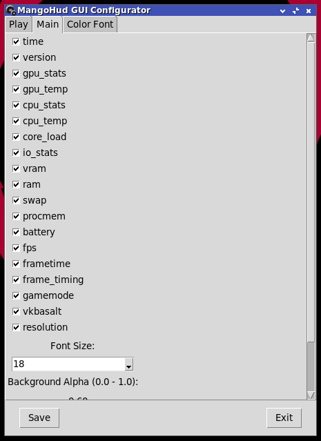

# fpscgui
FPSCGUI (FPS Counter GUI) is a Python-based application designed to help users easily utilize MangoHud &amp; GalliumHud
---
## FPSCGUI

---
# What is FPSCGUI?
FPSCGUI (FPS Counter GUI) is a Python-based application designed to help users easily utilize MangoHud & GalliumHud.
MangoHud & GalliumHud are tools used to display resource usage in games, videos, and other applications running on OpenGL or Vulkan in a terminal.
## GalliumHUD

---
## MangoHUD

---

# What should be noted?
1. Ensure that you have installed MangoHud, mangohud:i386 (if available), and mesa-utils or mesa-demos (depending on your distro).
2. Ensure that you have installed python3-tk (adjust based on your distro).
3. Make sure you know whether the application runs using OpenGL or Vulkan.
4. Follow these rules for resource monitoring:
   - If using OpenGL, you can use Gallium FPS or MangoHud FPS. To use MangoHud with OpenGL, select "Mango-GL" in the MangoHud FPS dropdown menu in the "Play" tab for monitoring.
   - If using Vulkan, you can use "Mango-VK" in the MangoHud FPS dropdown menu in the "Play" tab for monitoring.

# Required Packages (Debian-based command, adjust for other distros)
Note: If 32-bit repositories are available, enabling them and installing mangohud:i386 is recommended.
```
$ sudo dpkg --add-architecture i386
$ sudo apt update
$ sudo apt install mangohud mesa-utils
```

Optional (if supported):
```
$ sudo apt install mangohud:i386
```

# Running FPSCGUI
### Via GUI:
1. Download the latest version of FPSCGUI.
2. Open the ~/Downloads directory.
3. Extract FPSCGUI (you can use GUI applications like Xarchiver) into the ~/.fpscgui directory.
4. Double-click fpscgui.sh in ~/.fpscgui/fpscgui.sh.

### Via Terminal (Recommended):
1. Download the latest version of FPSCGUI.
2. Open a terminal and run:
```
$ cd ~/Downloads/
$ tar -xf fpscgui.tar.gz -C ~/
$ cd ~/.fpscgui
$ ./fpscgui.sh
```
## Gallium HUD Manager

---
# Gallium FPS Tab (Galliumhud HUD Manager)
1. **Executable List:** Displays a list of added executable applications.
2. **Create File:** Adds application shortcuts to the list (supports AppImage, .sh files) & (for .exe files, Wine must be installed first).
3. **Remove:** Deletes selected list items and shortcut files.
4. **Checkbox Show All Resource:** Displays complete resource usage.
5. **Show FPS, CPU, GPU:** Displays FPS count, CPU percentage, and GPU usage (if supported).
6. **Scale:** Adjusts text size (1, 2, 3, 4) (decimal values are not supported).
7. **Play:** Runs the selected shortcut from the list.
8. **Exit:** Closes Gallium FPS.

# Mangohud FPS Tab (MangoHud GUI Configurator)
### Note: Always save after configuring everything
---
## Play Tab

---
### Description:
1. **Box:** Displays a list of added executable applications.
2. **Create File:** Adds application shortcuts to the list (supports AppImage, .sh files) & (for .exe files, Wine must be installed first).
3. **Remove:** Deletes selected list items and shortcut files.
4. **Play:** Runs the selected shortcut from the list.
5. **Dropdown Menu:** Selects the rendering mode:
   - **Normal:** No FPS monitoring
   - **MangoVK:** MangoHud Vulkan
   - **MangoGL:** MangoHud OpenGL

## Main Tab

---
### Description:
1. **Checkbox:** Enables resource monitoring as per the checkbox name.
2. **Font Size:** Adjusts font size.
3. **Background Alpha:** Adjusts the MangoHud background transparency.
4. **HUD Position:** Sets the HUD position when running in a game or application.

### Color Font Tab

---
### Description:
1. All options are for adjusting colors.

### Bottom Section
1. **Save Button:** Saves the configuration settings.
2. **Exit Button:** Closes the MangoHud GUI Configuration.

# Uninstalling FPSCGUI
```
$ sudo rm -rf ~/.fpscgui
```


